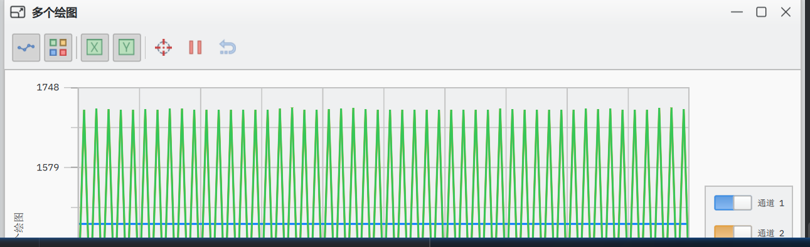
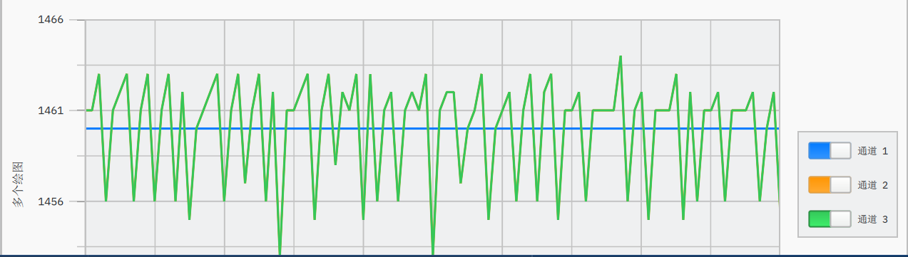
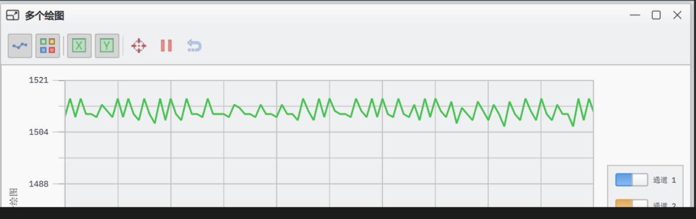
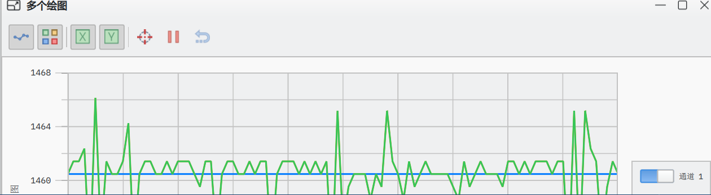

# 总述
本代码为STM32C876单片机内嵌代码，用于展示PID算法不同参数改变的效果。

# 制作过程
## 硬件部分
## 清单
- STM32C8T6单片机 以及配套ST-Link
- 杜邦线若干 跳线若干 面包板
- 光敏电阻 GL5516
- LED
- MOS管 ZVN2110A
- 电阻 470 欧（作为灯的串联保护电阻，按照LED驱动电流调整）
- 电阻 10K 欧
- TTL转USB接口
- 电脑一台
**注意** 所有元件都要是插件而不是贴片，否则无法在面包板上使用。
### 实物图
![[real.jpg]](description_photo/real.jpg)
上为面包板搭建的成品（不包含通信部分）。
### 文字示意图
```
	   ADC取样
	       | 
3.3V ─ [GL5516]-|-- [10kΩ]--GND
|
[STM32 开发板] -----USART通信|--RX--TX---|TTL转USB-----电脑
|			 |--TX--RX---|		
5V			 |----GND----|				
|
470欧
|
LED
|
D
|
MOS-G-------PWM控制
|
S                              
|
GND               
  
```
## 芯片引脚部分
![[芯片.png]](description_photo/芯片.png)


  
# 软件部分
重点
- ADC读取电压
- UART通信 自定义通信协议 SERIAL STUDIO
- PID

# 使用的电脑软件
- STM32cubemx 6.9.2
- CLion 2025.1.5.1(可选) 关于clion的配置与软件版本高度绑定，配置对我而言相当复杂，不了解该软件的人谨慎使用
# 历程


**动机**制作平衡小车受挫遂放弃，专门研究PID。

开始了解**上位机**这一概念，本项目的电脑即上位机，可以控制、调试单片机，观察数据。可以使用python自行编程或者选择现有串口可视化工具 serial studio。使用serial studio时将数据用逗号分开，传到上位机，可以在上位机看到图像。github有serial studio项目，它只有pro版，试用时间过后将在限制模式继续使用。

**为何不直接将灯和光敏电阻串联？**
如果没有MOS管而是直接将灯和光敏电阻串联，就无法使用PID，单纯是光敏电阻自己在控制电流。在该项目中光敏电阻负责接受反馈，控制还是要借助MOS，PWM适合发信号，不适合输出电流，同时MOS可以防倒灌，保护单片机。

选择MOS而不是BJT是因为MOS管由电压控制，而ADC可以换算出电压，PWM对应的MOS调节是线性变化，同时低压情况下一般使用MOS，减少很多麻烦。

**MOS管的封装和型号选择依据**：为保证MOS管可以在5v电压下正常工作，应该选用ZVN2110A，买 TO-92 或 TO-220 封装的。MOS的阈值电压是开始导通的时候，明显小于3.3V可以防止MOS意外关闭。 

光敏电阻的光强和电压不是一一对应的。我在全暗状态下测出PWM占空比为 10n %（n=0,1,2...,10）对应的ADC电压，想结合查表法和多项式拟合保证一一对应。研究发现多项式拟合效果不佳，决定在PWM和电压相对线性的区域，20%-50%观察。结合查表法和线性插值法，将PWM固定在50%观察现象。

INMIN指的是积分下限，不是输入下限。
传回多个参数应该用void函数加输入指针。将值当作地址传递编译器不会报错，但是实际代码会出错。

sprintf不支持浮点数打印，将原先的V变为mV,并将串口从阻塞式变为中断模式，atoi（）函数可以将字符串转为数字，使用单字节中断，防止缓冲区命令丢失。

static只会初始化一次，不会被反复初始化导致数据被覆盖。

由于每次通信时都要打标志位\r\n，通信期间多次使用时感觉非常麻烦，我转为固定长度（3）自动提交。

输出限制应该放在最后，芯片虽然不能输出负值，但是要知道正常的值，保证积分正常。

PID需要先K再D再I，同时PID建立在直接输出TARGET电压基础上进行微调，进一步减少由PID导致的波动。p指调节力度，d指预判强度，i为积分，防止结果稳定在非目标电压（消除静差）


# PID展示
| kp    | ki   | kd     | 响应曲线 ··································································· | 备注··················               |     |     |     |     |     |     |     |     |     |     |     |     |     |     |     |     |     |     |     |     |     |     |     |
| ----- | ---- | ------ | ---------------------------------------------------------------------------- | ------------------------------------ | --- | --- | --- | --- | --- | --- | --- | --- | --- | --- | --- | --- | --- | --- | --- | --- | --- | --- | --- | --- | --- | --- | --- |
| 0.05  | 0    | 0      |                                |                                      |     |     |     |     |     |     |     |     |     |     |     |     |     |     |     |     |     |     |     |     |     |     |     |
| 0.5   | 0    | 0      | ![[0.5 0 0.png]](description_photo/0.5-0-0.png)                              | 闪烁                                 |     |     |     |     |     |     |     |     |     |     |     |     |     |     |     |     |     |     |     |     |     |     |     |
| 极小  | 0    | 0      |                                                                              | 和kp=0时类似，单独作用时极小影响不大 |     |     |     |     |     |     |     |     |     |     |     |     |     |     |     |     |     |     |     |     |     |     |     |
| 0.05  | 0.5  | 0      |                           |                                      |     |     |     |     |     |     |     |     |     |     |     |     |     |     |     |     |     |     |     |     |     |     |     |
| 0.005 | 0.5  | 0      | ![[0.005 0.5 0.png]](description_photo/0.005-0.5-0.png)                      | 相较上图稀疏                         |     |     |     |     |     |     |     |     |     |     |     |     |     |     |     |     |     |     |     |     |     |     |     |
| 0.05  | 0.05 | 0      |                         | 积分几乎不起作用                     |     |     |     |     |     |     |     |     |     |     |     |     |     |     |     |     |     |     |     |     |     |     |     |
| 0.05  | 5    | 0      |                               |                                      |     |     |     |     |     |     |     |     |     |     |     |     |     |     |     |     |     |     |     |     |     |     |     |
| 0.05  | 0    | 0.01   | ![[0.05 0 0.01.png]](description_photo/0.05-0-0.1.png)                       | 闪烁                                 |     |     |     |     |     |     |     |     |     |     |     |     |     |     |     |     |     |     |     |     |     |     |     |
| 0.05  | 0    | 0.0015 | ![[0.05 0 0.0015.png]](description_photo/0.05-0.5-0.0015.png)                |                                      |     |     |     |     |     |     |     |     |     |     |     |     |     |     |     |     |     |     |     |     |     |     |     |
| 0.05  | 0    | 0.1    | ![[0.05 0 0.1.png]](description_photo/0.05-0-0.1.png)                        |                                      |     |     |     |     |     |     |     |     |     |     |     |     |     |     |     |     |     |     |     |     |     |     |     |
| 0.05  | 0.5  | 0.0015 | ![[0.05 0.5 0.0015.png]](description_photo/0.05-0.5-0.0015.png)              | 完美                                 |     |     |     |     |     |     |     |     |     |     |     |     |     |     |     |     |     |     |     |     |     |     |     |
| 0.01  | 0.5  | 0.0015 | ![[0.01 0.5 0.0015.png]](description_photo/0.01-0.5-0.0015.png)              |                                      |     |     |     |     |     |     |     |     |     |     |     |     |     |     |     |     |     |     |     |     |     |     |     |


